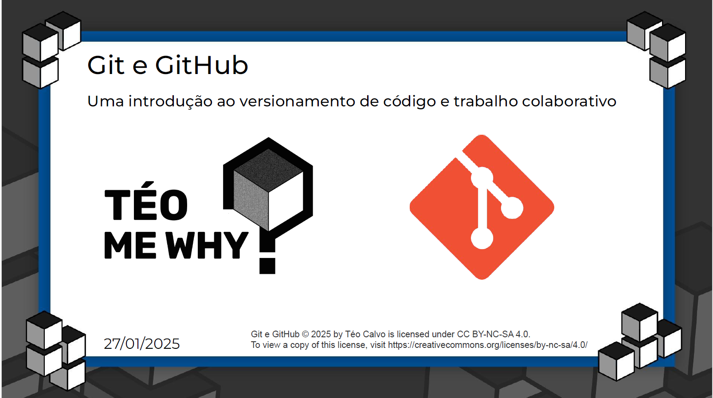

## **Curso GIT & GITHUB Teo me Why**-2025!

#### Curso breve de conceitos para git e github em versionamento de código e trabalho colaborativo. Perpassando de conceitos básicos & comandos para se realizar branchs e commits com foco em:

- Várias alterações de códigos em um projeto;

- Tomar decisões que são reversíveis
- Voltar o projeto devido a uma tomada de decisão que não quer se seguir

- Trabalhar com muitas pessoas em um mesmo projeto

  

#### Um curso para iniciantes aprenderem a tabalhar com versionamento de código e repositórios remotos com GITHUB

#### Também será trabalhado GITFLOW ao final do curso e Visual Studio Code

#### Curso pensado e ministrado pelo @TeoCalvo, disponível em: **_"https://www.youtube.com/playlist?list=PLvlkVRRKOYFQyKmdrassLNxkzSMM6tcSL"_**
